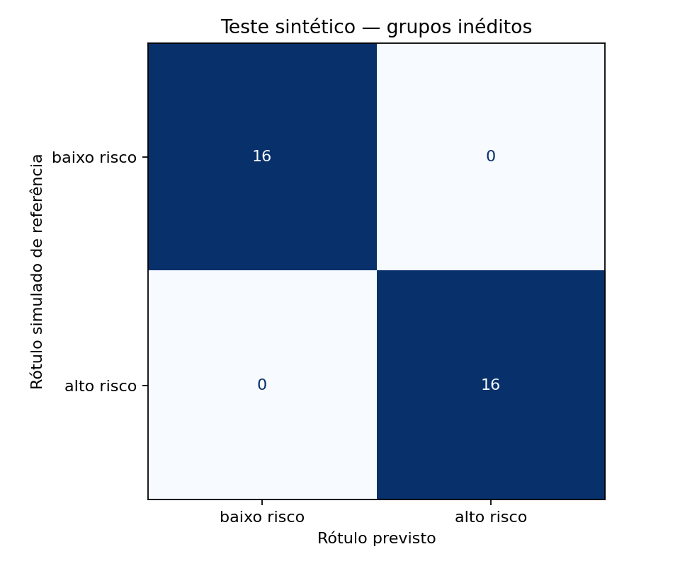

# FIAP - Faculdade de Informática e Administração Paulista

<p align="center"><a href="https://www.fiap.com.br/"></a></p>

# CardioIA — Diagnóstico Automatizado

## Nome do grupo

CardioIA — Guilherme Yamada Dantas

## 👨‍🎓 Integrantes

**Guilherme Yamada Dantas — RM 568506**

## 📜 Descrição

Projeto da Fase 2 de Inteligência Artificial e Machine Learning. O CardioIA demonstra duas abordagens complementares: extração de sintomas por regras e classificação de relatos sintéticos com TF-IDF e regressão logística. A primeira explica quais expressões acionam uma hipótese didática; a segunda aprende os rótulos `baixo risco` e `alto risco` a partir de exemplos elaborados para a atividade.

São dez relatos para extração e 160 frases rotuladas, organizadas em quarenta cenários. As quatro paráfrases de cada cenário ficam juntas no treino, na validação ou no teste. O vocabulário é aprendido somente no treino. O repositório inclui dados, notebooks executados, testes automatizados, matriz de confusão, previsões individuais e documentação de limites.

**É um experimento acadêmico com dados fictícios. Não faz diagnóstico, não estima risco clínico e não deve orientar atendimento.** Um resultado de `baixo risco` não indica que uma pessoa esteja segura. Os dados e rótulos não foram validados por profissionais de saúde.

Uma demonstração local permite explorar os dez relatos, digitar exemplos fictícios e comparar regras e modelo. Ela é complementar ao trabalho obrigatório e não substitui o portal React do desafio opcional.

## Resultados medidos

| Partição | Frases | Cenários | Acurácia |
|---|---:|---:|---:|
| Treino | 96 | 24 | 100% |
| Validação | 32 | 8 | 75% |
| Teste reservado | 32 | 8 | 100% |
| Baseline majoritário no teste | 32 | 8 | 50% |

Confira os valores auditáveis em [métricas](document/evidencias/metricas.json), [partições](document/evidencias/particoes.csv) e [previsões do teste](document/evidencias/previsoes_teste.csv). O teste teve 16 exemplos de cada classe e nenhum falso negativo observado. A validação teve oito erros; a diferença de 75% para 100% entre conjuntos pequenos reforça a instabilidade da avaliação.

**O resultado perfeito expõe também a facilidade do corpus.** Todos os textos vêm do mesmo processo de elaboração e possuem padrões recorrentes. São oito grupos no teste, não 32 observações independentes. Uma sondagem posterior mostra que o classificador atribui `alto risco` tanto a “Sinto falta de ar” quanto a “Não sinto falta de ar”. Isso evidencia fragilidade linguística apesar da métrica alta; não constitui uma avaliação clínica. Veja [desafio linguístico](document/evidencias/desafio_linguistico.json).



## 📁 Estrutura de pastas

```text
.github/workflows/     Verificação automática
assets/dados/          Dez relatos, mapa, frases rotuladas e metadados
config/               Estado explícito de publicação e entrega
document/             Metodologia, governança, revisão e roteiro de vídeo
document/evidencias/   Métricas, partições, previsões e capturas reais
notebooks/            Dois notebooks obrigatórios e um extra ECG executados
extras/ecg/           MLP Keras, ECGs, licença, modelo, métricas e vídeo próprio
scripts/              Execução, evidências e conferência do pacote
src/                  Extração e classificação
tests/                Testes dos dados, modelos, integração e interface
app.py                Demonstração local em Streamlit
requirements.txt      Dependências diretas fixadas
requirements-lock.txt Ambiente completo usado na verificação
```

## 🔧 Como executar o código

Requer Python 3.11, acesso à internet apenas para instalar as dependências e terminal na raiz do repositório. Os dados acompanham o projeto; treinamento e demonstração funcionam localmente sem serviços de IA ou chaves de API.

```bash
git clone https://github.com/japatraderdev99/cap2-robos-sinapses-medicina-guilherme-yamada-dantas.git
cd cap2-robos-sinapses-medicina-guilherme-yamada-dantas
python3.11 -m venv .venv
source .venv/bin/activate
python -m pip install -r requirements.txt
python scripts/gerar_evidencias.py
python scripts/executar_notebooks.py
python -m pytest -q
python scripts/verificar_entrega.py --extras
```

No Windows, ative o ambiente com `.venv\Scripts\activate`. Para reproduzir exatamente as versões transitivas do ambiente macOS verificado, use `requirements-lock.txt`; o arquivo de dependências diretas é a opção portátil e a CI está configurada para Linux, ainda sem execução remota confirmada.

O executor de notebooks inicia um kernel limpo para cada um dos dois notebooks obrigatórios usando o Python ativo, sem exigir instalação global de kernel. O notebook 03 usa o ambiente separado descrito em [ECG](extras/ecg/README.md). Os notebooks também podem ser abertos em Jupyter ou VS Code com o ambiente selecionado. Execute todas as células na ordem.

### Demonstração interativa

```bash
python -m streamlit run app.py
```

Abra o endereço local mostrado no terminal. A aplicação treina o pequeno modelo uma vez e mantém o resultado em memória. As evidências da sessão usam pasta temporária; não sobrescrevem as evidências da entrega. Dados digitados não são gravados em arquivo pelo aplicativo. Use somente relatos fictícios.

### Executar cada parte separadamente

```bash
python -m src.extracao
python -m src.classificacao
```

O primeiro comando imprime as dez análises. O segundo treina e salva métricas, gráfico e previsões. A [metodologia](document/metodologia.md) explica os parâmetros fixos e as métricas.

## Vídeos de demonstração

| Parte | YouTube | Duração exibida |
|---|---|---|
| Obrigatório — NLP | [Vídeo 1](https://www.youtube.com/watch?v=KCmZu85N5qk) | 2:24 |
| Ir Além 1 — Portal React | [Vídeo 2](https://www.youtube.com/watch?v=ZsAI8kAWcYw) | 2:39 |
| Ir Além 2 — ECG e MLP | [Vídeo 3](https://www.youtube.com/watch?v=1bPnMXL78pU) | 3:15 |

## Entregáveis

| Requisito | Evidência |
|---|---|
| Dez relatos completos | [TXT](assets/dados/frases_sintomas.txt) |
| Mapa de conhecimento | [CSV](assets/dados/mapa_conhecimento.csv) |
| Extração funcional | [Código](src/extracao.py) e [notebook 1](notebooks/01_extracao.ipynb) |
| Base de texto rotulada | [CSV](assets/dados/frases_rotuladas.csv) e [metadados](assets/dados/metadados_frases.csv) |
| TF-IDF, classificação e avaliação | [Notebook 2](notebooks/02_classificacao_texto.ipynb) |
| Documentação e revisão | [Checklist](document/checklist-entrega.md) e [revisão independente](document/revisao-independente.md) |
| Vídeo de até quatro minutos | [MP4 final com legendas — 2min24s](document/video/Video-1-CardioIA-NLP-Extracao-e-Classificacao-de-Sintomas.mp4); [Assistir no YouTube — não listado](https://www.youtube.com/watch?v=KCmZu85N5qk) |
| Repositório público com arquivos | [Repositório público](https://github.com/japatraderdev99/cap2-robos-sinapses-medicina-guilherme-yamada-dantas) |
| Envio na plataforma FIAP | **Pendente** |

O verificador diferencia artefatos locais e pendências de entrega. `python scripts/verificar_entrega.py --final` exige também os registros de publicação, vídeo e envio em `config/entrega.json`; não valida acesso remoto nem substitui conferência humana dos links. Nenhum link fictício é usado para preencher requisito.

## Qualidade e limites

- Extração: negação simples, limites de palavras, mudança explícita de sujeito, casos familiares e contradições. Regras não equivalem a compreensão geral de linguagem.
- Aprendizado: separação por cenário, verificação de hashes, TF-IDF ajustado só no treino, baseline e parâmetros fixos.
- Avaliação: métricas por classe, falsas negativas registradas, sondagem de negação e seis pares contrafactuais de gênero/idade. A sondagem não certifica equidade.
- Reprodutibilidade: dados incluídos, versões fixadas, notebooks executados e testes. Resultados clínicos permanecem não avaliados.

A [verificação do pacote](document/verificacao-pacote.md) registra a reprodução do núcleo em um segundo ambiente virtual, com métricas idênticas. A revisão final de 07/10/2026 passou em **33 testes**: 26 do núcleo e sete do verificador ECG. `--extras` audita imagens, pacientes, notebook e métricas do ECG sem importar TensorFlow. O portal é verificado separadamente com `npm test`, `npm run build` e `npm run format:check` no projeto próprio.

Veja [dados e ontologia](document/dados-e-ontologia.md), [governança e limitações](document/governanca-e-limitacoes.md) e [metodologia](document/metodologia.md).

## Continuidade da Fase 1

A [Fase 1](https://github.com/japatraderdev99/fiap-preparando-terreno-para-inteligencia-cardiologica) organizou dados cardiológicos e documentação. Nesta fase, o núcleo usa textos simulados conforme o enunciado; não converte dados tabulares anteriores em falsos relatos clínicos.

O extra visual está implementado: [MLP de ECG](extras/ecg/README.md), [notebook executado](notebooks/03_mlp_ecg.ipynb) e [análise](document/ecg.md). Reutiliza 120 imagens públicas da Fase 1, remove o cabeçalho com diagnóstico e mantém pacientes separados. No teste obteve **79,17%, igual ao baseline**, com todas as 24 previsões anormais e recall normal de 0%. A implementação funciona, mas não demonstrou discriminação binária útil no limiar definido. O [vídeo próprio de 3min15s](extras/ecg/video/CardioIA-ECG-demonstracao.mp4) mostra os resultados reais.

O **Ir Além 1 — portal React** foi preparado como projeto separado, `guilherme-yamada-dantas-cardioia-portal`, com autenticação simulada, pacientes, agenda, painel e sete testes aprovados. Projeto: [portal React](https://github.com/japatraderdev99/guilherme-yamada-dantas-cardioia-portal).

**Vídeos publicados no YouTube como não listados e conferidos em 07/10/2026. O envio na FIAP será feito pelo aluno.** O núcleo e o ECG compartilham este repositório; o portal requer repositório separado conforme o enunciado.

## 🗃 Histórico de lançamentos

- **0.3.0 — 07/10/2026:** repositórios publicados, três vídeos não listados vinculados e arquivos de entrega atualizados. Submissão FIAP pendente.

- **0.2.0 — 07/10/2026:** extra ECG executado e avaliado, vídeo próprio, preparação do portal React separado e empacotamento para envio pelo aluno. Código publicado; YouTube e envio FIAP pendentes.

- **0.1.0 — 06/10/2026:** implementação local do núcleo, notebooks, evidências, revisão, demonstração acadêmica e vídeo local de 3min28s. Publicação e envio ainda pendentes.

## 📋 Licença e referências

- [Template FIAP utilizado como referência de organização](https://github.com/agodoi/templateFiapVfinal), atribuição CC BY 4.0 mantida. As seções de docentes não se aplicam à identificação solicitada para esta entrega.
- [Scikit-learn — prevenção de vazamento](https://scikit-learn.org/stable/common_pitfalls.html#data-leakage).
- [NHLBI — sintomas de infarto](https://www.nhlbi.nih.gov/health/heart-attack/symptoms).
- [NHLBI — sintomas de insuficiência cardíaca](https://www.nhlbi.nih.gov/health/heart-failure/symptoms).

Atribuição do modelo de documentação: FIAP, [Creative Commons Attribution 4.0 International](https://creativecommons.org/licenses/by/4.0/). As fontes médicas sustentam o vocabulário; não validam as regras ou rótulos deste projeto. Nenhum e-book ou Fast Test acompanha a publicação do código. Consulte [LICENSE](LICENSE).
